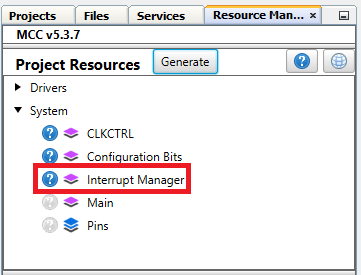
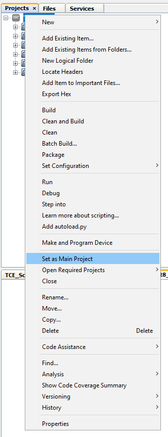
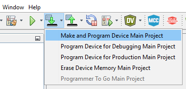

[](https://www.microchip.com)

## PWM Signal Modulation Code Example

Below is an example of how to generate a sinewave signal using a Pulse-Width Modulation (PWM) signal. The PWM is generated using Timer/Counter type E (TCE) with scaling feature set to BOTTOM, in Single-Slope mode. The Waveform Extension (WEX) peripheral is used to generate one complementary signal for the PWM generated by TCE, with dead time added between the two signals. Basically, this example simulates the phase of a three phase BLDC motor that is driven in sinusoidal mode.

## Related Documentation

More details and code examples on the AVR16EB32 can be found at the following links:

- [AVR<sup>®</sup> EB Product Page](https://www.microchip.com/en-us/product/AVR16EB32)
- [AVR<sup>®</sup> EB Code Examples on GitHub](https://github.com/microchip-pic-avr-examples?q=AVR16EB32)

## Software Used

- [MPLAB® X IDE v6.15 or newer](https://www.microchip.com/en-us/tools-resources/develop/mplab-x-ide)
- [AVR-Ex DFP-2.8.189 or newer Device Pack](https://packs.download.microchip.com/)
- [MPLAB® XC8 compiler v2.45](https://www.microchip.com/en-us/tools-resources/develop/mplab-xc-compilers/downloads-documentation#XC8)
- [MPLAB® Code Configurator (MCC) v5.3.7](https://www.microchip.com/en-us/tools-resources/configure/mplab-code-configurator)
- [MPLAB® Code Configurator (MCC) Melody Core v2.6.2 or newer](https://www.microchip.com/en-us/tools-resources/configure/mplab-code-configurator)

## Hardware Used

- [AVR<sup>®</sup> EB Curiosity Nano](https://www.microchip.com/en-us/product/AVR16EB32)

## Setup

The AVR16EB32 Curiosity Nano Development board is used as a test platform.

<br>

## Functionality

<br>After the peripheral clock, the output port pins, TCE and WEX are initialized, the  ``Sinewave_Modulation``` function is called in an infinite loop. This function is registered as a callback and is called every 50 μs on the TCE's Overflow Interrupt Service Routine (ISR).

<br>This application configures the TCE to run in Single Ramp mode at 20K Hz. The TCE generates one Pulse-Width Modulation (PWM) signal. The WEX is configured in Waveform Extension Mode and is able to generate a complementary PWM signal for the one generated by the TCE. It adds dead time in the hardware so the two signals are not overlapping. Dead time values are set to 500 ns both on the low side and high side of the two PWM signals.

<br>The sinusoidal signal is generated using a Lookup Table (LUT). The values from the LUT are automatically scaled using TCE's scaling hardware accelerator. At run time the amplitude is initially set to 100% and the frequency is set to 500 Hz. Then after a 1 second delay, the amplitude is set to 50% and the frequency is doubled to 1000 Hz. After another delay of 1 second the process repeats itself over and over again.

## Function Called in an Infinite Loop

```c
void Sinewave_Modulation(void)
{
    uint16_t pwm;
    static uint16_t sinewave = 0;
    
    /* Increment LUT counter depending on the frequency set at runtime */
    sinewave += frequency;
    
    /* Select a new value from LUT */
    pwm = sine_lookup_table[(sinewave >> 8)];
    
    /* Update the AMP register with the amplitude set at runtime */
    TCE0_AmplitudeSet(amplitude);
    
    /* Update CMP register of TCE with a new value from LUT */
    TCE0_PWM_BufferedDutyCycle0Set(pwm);
}
```

<br>

<br>This project is generated using MPLAB X IDE and the MPLAB X Code Configurator (MCC) Melody (MCC Classic is not supported on this device). To do this follow the next steps:

<br>1. Open MPLAB X IDE and create a new project for the AVR16EB32 device.

<br>2. Open MCC from the toolbar (more information on how to install the MCC plug-in can be found [here](https://onlinedocs.microchip.com/pr/GUID-1F7007B8-9A46-4D03-AEED-650357BA760D-en-US-6/index.html?GUID-D98198EA-93B9-45D2-9D96-C97DBCA55267)).

<br>3. From the **MCC Content Manager** tab click the **Select MCC Melody** button and then click **Finish**.<br>
<br>
<br>

<br>4. Click Project _Resources>System>CLKCTRL_, then do the following configuration:
<br>
    <br> - Disable the Prescaler enable button
<br>

<br>5. Click _Project Resources>System>Interrupt Manager_, then do the following configuration:
<br>
<br>  

<br>6. To add the TCE module, go to _Device Resources>Drivers>Timer>TCE0_, then do the following configuration:
<br>
    <br> - Module Enable: Must be enabled by default, if not, just toggle the button (it turns blue if enabled)
    <br> - Clock Selection: System clock (by default the divider must be 1 - System clock)
    <br> - Waveform Generation Mode: Single-slope PWM mode with overflow on TOP
    <br> - Requested Period [s]: 0.00005
    <br> - Duty Cycle 0 [%]: 0
    <br> - Waveform Output n : Check the boxes from the Enable column for Waveform Output 0
    <br> - Scale mode: CMP values are scaled from BOTTOM, 0% duty cycle (Scale mode will be modified at run time)
    <br> - Scaled Writing to registers: Fractional
    <br> - Amplitude Control Enable: Toggle the button (it turns blue if enabled)
    <br> - Amplitude Value: 1
    <br> - Generate ISR: Toggle the button (it turns blue if enabled)
    <br> - Overflow Interrupt Enable: Toggle the button (it turns blue if enabled)
<br>

<br>7. To add the WEX module, go to _Device Resources>Drivers>WEX>WEX0_, then do the following configuration:
<br>
    <br> - Input Matrix: Direct
    <br> - Update Source: TCE (the update condition for the output signals will be dictated by TCE)
    <br> - Override Settings: Check all the boxes from the Output Enable column for the Waveform Output [0-1]
    <br> - Dead-time Insertion Channel 0 Enable: toggle the button (it turns blue if enabled)
    <br> - Requested Dead-time Low Side (μs) : 0.5
    <br> - Requested Dead-time High Side (μs) : 0.5
<br>
  
<br>8. In the **Pin Grid View** tab check if the WO0 and WO1 output pins are locked as outputs on PORTA. When the boxes from the Enable column in the Output Settings of WEX are checked, the pins are also locked. To change the PORT simply click a pin from another PORT in **Pin Grid View**.

 |Pin                       | Configuration       |
 | :---------------------:  | :----------------:  |
 |            PA0           |   WEX WO0           |
 |            PA1           |   WEX WO1           |

 <br>

<br>9. In the **Project Resources** tab, click the **Generate** button so that MCC will generate all the specified drivers and configurations.
<br>
<br>
<br>
<br>

<br>10. After MCC Melody generates the project files with the configuration explained above, overwrite the content from the ```main.c``` file with this:

```c
/* Set the frequency of the Signal in Hz in the range of 0 - 1000Hz */
#define FREQ_HZ(X)                (uint16_t)(3.33 * (float)(X)) 

/* Set the amplitude of the sinewave in the range of 0 - 100% */
#define AMPLITUDE_PERCENT(X)      (uint16_t)((float)(X) * 327.68)          

#include "mcc_generated_files/system/system.h"
#include <util/delay.h>
#include <stdint.h>


/* Lookup table used to generate a complete period of the sine signal */
const uint16_t sine_lookup_table[] = 
{
  16384, 16786, 17187, 17589, 17989, 18389, 18788, 19185, 19580, 19973, 20364, 
  20753, 21140, 21523, 21903, 22280, 22653, 23023, 23389, 23750, 24107, 24459, 24807, 
  25149, 25486, 25818, 26143, 26463, 26777, 27085, 27386, 27681, 27969, 28250, 28523, 
  28790, 29049, 29300, 29543, 29779, 30006, 30226, 30437, 30639, 30833, 31018, 31194, 
  31362, 31520, 31670, 31810, 31941, 32062, 32174, 32276, 32369, 32453, 32526, 32590, 
  32644, 32689, 32723, 32748, 32763, 32768, 32763, 32748, 32723, 32689, 32644, 32590, 
  32526, 32453, 32369, 32276, 32174, 32062, 31941, 31810, 31670, 31520, 31362, 31194, 
  31018, 30833, 30639, 30437, 30226, 30006, 29779, 29543, 29300, 29049, 28790, 28523, 
  28250, 27969, 27681, 27386, 27085, 26777, 26463, 26143, 25818, 25486, 25149, 24807, 
  24459, 24107, 23750, 23389, 23023, 22653, 22280, 21903, 21523, 21140, 20753, 20364, 
  19973, 19580, 19185, 18788, 18389, 17989, 17589, 17187, 16786, 16384, 15981, 15580, 
  15178, 14778, 14378, 13979, 13582, 13187, 12794, 12403, 12014, 11627, 11244, 10864, 
  10487, 10114, 9744, 9378, 9017, 8660, 8308, 7960, 7618, 7281, 6949, 6624, 6304, 5990, 
  5682, 5381, 5086, 4798, 4517, 4244, 3977, 3718, 3467, 3224, 2988, 2761, 2541, 2330, 
  2128, 1934, 1749, 1573, 1405, 1247, 1097, 957, 826, 705, 593, 491, 398, 314, 241, 
  177, 123, 78, 44, 19, 4, 0, 4, 19, 44, 78, 123, 177, 241, 314, 398, 491, 593, 705, 
  826, 957, 1097, 1247, 1405, 1573, 1749, 1934, 2128, 2330, 2541, 2761, 2988, 3224, 
  3467, 3718, 3977, 4244, 4517, 4798, 5086, 5381, 5682, 5990, 6304, 6624, 6949, 7281, 
  7618, 7960, 8308, 8660, 9017, 9378, 9744, 10114, 10487, 10864, 11244, 11627, 12014, 
  12403, 12794, 13187, 13582, 13979, 14378, 14778, 15178, 15580, 15981
};

uint16_t frequency;
uint16_t amplitude;

void Sinewave_Modulation(void)
{
    uint16_t pwm;
    static uint16_t sinewave = 0;
    
    /* Increment LUT counter depending on the frequency set at runtime */
    sinewave += frequency;
    
    /* Select a new value from LUT */
    pwm = sine_lookup_table[(sinewave >> 8)];
    
    /* Update the AMP register with the amplitude set at runtime */
    TCE0_AmplitudeSet(amplitude);
    
    /* Update CMP register of TCE with a new value from LUT */
    TCE0_PWM_BufferedDutyCycle0Set(pwm);
}

int main(void)
{
    SYSTEM_Initialize();
    TCE0_OverflowCallbackRegister(Sinewave_Modulation);
    frequency = 0;
    amplitude = 0;

    while(1)
    {
        /* Set the ampitude of the sine to be 100%, duty cycles values range from 0 to 100% minus added dead time */
        amplitude = AMPLITUDE_PERCENT(100);
        
        /* Set sine frequency in Hz */
        frequency = FREQ_HZ(500);
        
        _delay_ms(1000);
        
        /* Set the ampitude of the sine to be 50%, duty cycles values range from 0 to 50% */
        amplitude = AMPLITUDE_PERCENT(50);
        
        /* Set sine frequency in Hz */
        frequency = FREQ_HZ(1000);
        
        _delay_ms(1000);
    }    
}
```

<br>11. Now the project can be built and run from MPLAB X IDE. At run time, the generated sinusoidal signal can be modulated in frequency by increasing or decreasing the LUT scrolling speed. Also the sinusoidal signal can be modulated in amplitude by changing the amplitude value in the AMP register of the TCE, and the rest is done by the scaling hardware accelerator of the module.

 ## Operation

 1. Connect the board to the PC.

 2. Open the ```PWM_Modulation.X``` solution in MPLAB X IDE.

 3. Right click the project and select Set as main project.

<br>

 4. Build the ```PWM_Modulation.X``` project by clicking **Clean and Build Project**.

<br>

 5. Click **Make and Program Device** to program the project to the board.

<br>

## Results

Below are logic analyzer captures to help understand how the PWM signals look, and how the generated sinewave looks. For visualizing the sinewave, a hardware analog filter was used:

<br>A complete period of the generated sinewave
<br>

<br>Generated Sinewave
<br>

## Summary

This project shows how to use the TCE and WEX to generate sinewave signals and how to modulate them depending on the amplitude, offset, and period values set in TCE's registers.