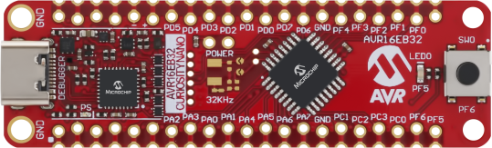
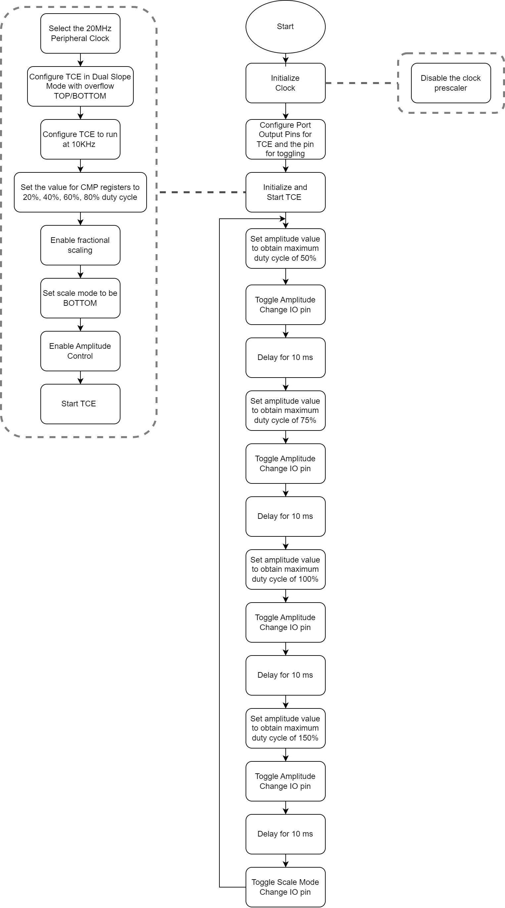
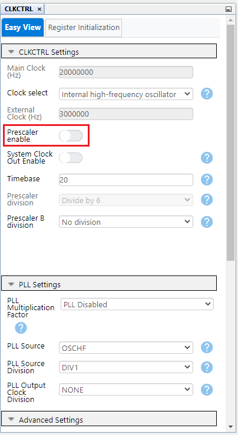
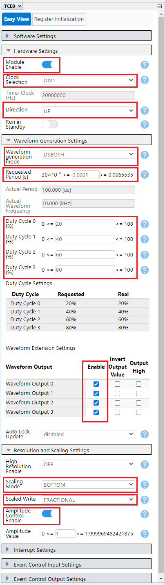
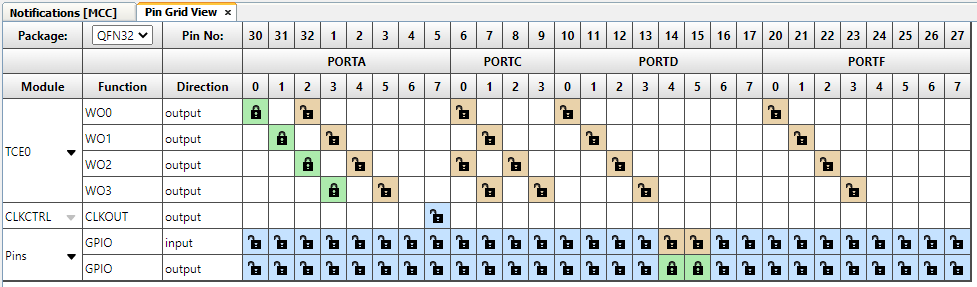
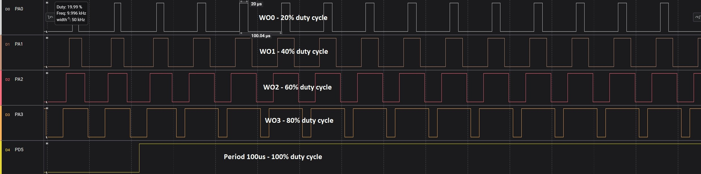
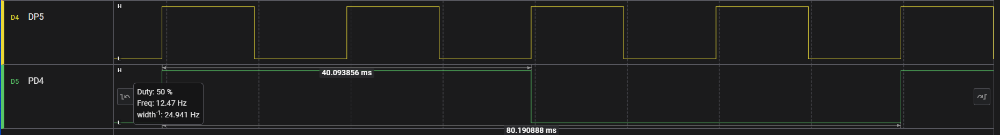

[](https://www.microchip.com)

## Scaling Code Example

Below is an example of how to set a TCE instance to generate four Pulse-Width Modulation (PWM) signals at 10 kHz with 20%, 40%, 60% and 80% duty cycles. In this example the scaling feature of the values set in compare registers is highlighted. The scale mode is changed at run time and the changes are affecting the duty cycles values.

## Related Documentation

More details and code examples on the AVR16EB32 can be found at the following links:

- [AVR<sup>®</sup> EB Product Page](https://www.microchip.com/en-us/product/AVR16EB32)
- [AVR<sup>®</sup> EB Code Examples on GitHub](https://github.com/microchip-pic-avr-examples?q=AVR16EB32)

## Software Used

- [MPLAB® X IDE v6.15 or newer](https://www.microchip.com/en-us/tools-resources/develop/mplab-x-ide)
- [AVR-Ex DFP-2.8.189 or newer Device Pack](https://packs.download.microchip.com/)
- [MPLAB® XC8 compiler v2.45](https://www.microchip.com/en-us/tools-resources/develop/mplab-xc-compilers/downloads-documentation#XC8)
- [MPLAB® Code Configurator (MCC) v5.3.7](https://www.microchip.com/en-us/tools-resources/configure/mplab-code-configurator)
- [MPLAB® Code Configurator (MCC) Melody Core v2.6.2 or newer](https://www.microchip.com/en-us/tools-resources/configure/mplab-code-configurator)

## Hardware Used

- [AVR<sup>®</sup> EB Curiosity Nano](https://www.microchip.com/en-us/product/AVR16EB32)

## Setup

The AVR16EB32 Curiosity Nano Development board is used as a test platform.

<br>

## Functionality

<br>After the peripheral clock, the output port pins and TCE are initialized, the  ```Scale_Mode_Change``` function is called in an infinite loop. This function changes the value written in the AMP every 10 ms register and also changes the scale mode every 40 ms. Based on this value, the values that are initially written in the CMPBUF registers of TCE are scaled in hardware. TCE has a scaling hardware accelerator that modifies the values from CMPBUF registers based on the scale mode and the values from AMP and OFFSET registers. In this application, the amplitude is changed so the maximum duty cycle possible has the following values: 50%, 75%, 100% and 150%.

<br>For example if the scale mode is set to CENTER, when the amplitude is set so that the maximum duty cycle is 50%, the initial value from CMP0BUF of 20% duty cycle gets scaled to 10%. The initial value from CMP1BUF of 40% duty cycle gets scaled to 20%. The initial value from CMP2BUF of 60% duty cycle gets scaled to 30%. The initial value from CMP3BUF of 80% duty cycle gets scaled to 40%. An important thing to note is that if the scaled duty cycle is higher than 100%, it will be saturated at 100%, meaning the output pin of TCE will stay in logic `1` high. The Scale mode is first set to CENTER, then BOTTOM, TOP and TOP-BOTTOM. After that, the process repeats itself over and over again.

<br>The values in CMPBUF registers must be rewritten for the amplitude change to take place. To be able to see the changes on a logic analyzer, an IO pin (PD5) is set to toggle when a change in amplitude has taken place. Another IO pin (PD4) is set to toggle when the scale mode is modified.

## Function Called in an Infinite Loop

```c
void Scale_Mode_Change(uint8_t scale_mode)
{
    /* Set the scale mode */
    TCE0_ScaleModeSet(scale_mode);
    
    /* Set the amplitude levele so that the maximum duty cycle possible is 50% */
    TCE0_AmplitudeSet(AMPLITUDE_MAX_DCY_50_PERCENT);
    
    /* Update the values of CMP registre so that the amplitude change takes place */
    TCE0_CompareAllChannelsBufferedSet(DUTY_CYCLE_20_PERCENT, DUTY_CYCLE_40_PERCENT, DUTY_CYCLE_60_PERCENT, DUTY_CYCLE_80_PERCENT);
    
    /* Used to know when the amplitude level has changed */
    IO_PD5_Toggle();
    
    _delay_ms(10);
    
    /* Set the amplitude levele so that the maximum duty cycle possible is 75% */
    TCE0_AmplitudeSet(AMPLITUDE_MAX_DCY_75_PERCENT);
    
    /* Update the values of CMP registre so that the amplitude change takes place */
    TCE0_CompareAllChannelsBufferedSet(DUTY_CYCLE_20_PERCENT, DUTY_CYCLE_40_PERCENT, DUTY_CYCLE_60_PERCENT, DUTY_CYCLE_80_PERCENT);
    
    /* Used to know when the amplitude level has changed */
    IO_PD5_Toggle();
    
    _delay_ms(10);
    
    /* Set the amplitude levele so that the maximum duty cycle possible is 100% */
    TCE0_AmplitudeSet(AMPLITUDE_MAX_DCY_100_PERCENT);
    
    /* Update the values of CMP registre so that the amplitude change takes place */
    TCE0_CompareAllChannelsBufferedSet(DUTY_CYCLE_20_PERCENT, DUTY_CYCLE_40_PERCENT, DUTY_CYCLE_60_PERCENT, DUTY_CYCLE_80_PERCENT);
    
    /* Used to know when the amplitude level has changed */
    IO_PD5_Toggle();
    
    _delay_ms(10);
    
    /* Set the amplitude levele so that the maximum duty cycle possible is 150% */
    TCE0_AmplitudeSet(AMPLITUDE_MAX_DCY_150_PERCENT);
    
    /* Update the values of CMP registre so that the amplitude change takes place */
    TCE0_CompareAllChannelsBufferedSet(DUTY_CYCLE_20_PERCENT, DUTY_CYCLE_40_PERCENT, DUTY_CYCLE_60_PERCENT, DUTY_CYCLE_80_PERCENT);
    
    /* Used to know when the amplitude level has changed */
    IO_PD5_Toggle();
    
    _delay_ms(10);
    
    /* Used to know when the scale mode has changed */
    IO_PD4_Toggle();
}
```

<br>

<br>To generate this project using MPLAB X IDE and the MPLAB X Code Configurator (MCC Melody, MCC Clasic is not supported on this device), follow the next steps:

<br>1. Open MPLAB X IDE and create a new project for AVR16EB32 device.

<br>2. Open MCC from the toolbar (more information on how to install the MCC plug-in can be found [here](https://onlinedocs.microchip.com/pr/GUID-1F7007B8-9A46-4D03-AEED-650357BA760D-en-US-6/index.html?GUID-D98198EA-93B9-45D2-9D96-C97DBCA55267)).

<br>3. In **MCC Content Manager** tab click the **Select MCC Melody** button and then click **Finish**.<br>
<br>
<br>

<br>4. Click on Project _Resources>System>CLKCTRL_, then do the following configuration:
<br>
    <br> - Disable the Prescaler enable button
<br>

<br>5. To add the TCE module, go to _Device Resources>Drivers>Timer>TCE0_, then do the following configuration:
<br>
    <br>  - Module Enable: Must be enabled by default, if not just toggle the button (it turns blue if enabled)
    <br>  - Clock Selection: System clock (by default the divider must be 1 - System clock)
    <br>  - Counter Direction: UP
    <br>  - Waveform Generation Mode: Dual-slope PWM mode with overflow on TOP and BOTTOM (DSBOTH)
    <br>  - Requested Period[s]: 0.0001
    <br>  - Duty Cycle 0 [%] : 20
    <br>  - Duty Cycle 1 [%] : 40
    <br>  - Duty Cycle 2 [%] : 60
    <br>  - Duty Cycle 3 [%] : 80
    <br>  - Waveform Output n : check the boxes from the Enable column for Waveform Output 0, 1, 2, 3
    <br>  - Duty Cycle High Resolution: Resolution increased by 4
    <br>  - Scale mode: CMP values are scaled from Bottom, 0% DC (duty cycle)
    <br>  - Scaled Writing to registers: Fractional
    <br>  - Amplitude Control Enable: toggle the button (it turns blue if enabled)
    <br>  - Amplitude Value: 1
<br>

<br>6. In the **Pin Grid View** tab check if the TCE WO [0-3] pins are locked as outputs on PORTA. When the boxes from Enable column from Output Settings of TCE are checked, the pins are also locked. To change the PORT simply click a pin from another PORT in **Pin Grid View**. Select from **Pin Grid View** tab PIN5 and PIN4 of PORTD as outputs to toggle when the amplitude, compare values and scale mode changes.

 |            Pin           |    Configuration    |
 | :---------------------:  | :----------------:  |
 |            PA0           |   TCE WO0           |
 |            PA1           |   TCE WO1           |
 |            PA2           |   TCE WO2           |
 |            PA3           |   TCE WO3           |
 |            PD5           |   digital output    |
 |            PD4           |   digital output    |

<br>

<br>7. In the Project Resources window, click the **Generate** button so that MCC will generate all the specified drivers and configurations.
<br>
<br>
<br>
<br>

<br>8. After the MCC Melody generates the project files with the configuration explained above, overwrite the content from main.c file with this:

```c
/* Calculated values for Period, CMP, Amplitude and OFFSET registers */
#define DUTY_CYCLE_20_PERCENT           (0x1999)
#define DUTY_CYCLE_40_PERCENT           (0x3333)
#define DUTY_CYCLE_60_PERCENT           (0x4CCC)
#define DUTY_CYCLE_80_PERCENT           (0x660C)
#define AMPLITUDE_MAX_DCY_50_PERCENT    (0x4000)
#define AMPLITUDE_MAX_DCY_75_PERCENT    (0x6000)
#define AMPLITUDE_MAX_DCY_100_PERCENT   (0x8000)
#define AMPLITUDE_MAX_DCY_150_PERCENT   (0xC000)

#include "mcc_generated_files/system/system.h"
#include <util/delay.h>

void Scale_Mode_Change(uint8_t scale_mode)
{
    /* Set the scale mode */
    TCE0_ScaleModeSet(scale_mode);
    
    /* Set the amplitude levele so that the maximum duty cycle possible is 50% */
    TCE0_AmplitudeSet(AMPLITUDE_MAX_DCY_50_PERCENT);
    
    /* Update the values of CMP registre so that the amplitude change takes place */
    TCE0_CompareAllChannelsBufferedSet(DUTY_CYCLE_20_PERCENT, DUTY_CYCLE_40_PERCENT, DUTY_CYCLE_60_PERCENT, DUTY_CYCLE_80_PERCENT);
    
    /* Used to know when the amplitude level has changed */
    IO_PD5_Toggle();
    
    _delay_ms(10);
    
    /* Set the amplitude levele so that the maximum duty cycle possible is 75% */
    TCE0_AmplitudeSet(AMPLITUDE_MAX_DCY_75_PERCENT);
    
    /* Update the values of CMP registre so that the amplitude change takes place */
    TCE0_CompareAllChannelsBufferedSet(DUTY_CYCLE_20_PERCENT, DUTY_CYCLE_40_PERCENT, DUTY_CYCLE_60_PERCENT, DUTY_CYCLE_80_PERCENT);
    
    /* Used to know when the amplitude level has changed */
    IO_PD5_Toggle();
    
    _delay_ms(10);
    
    /* Set the amplitude levele so that the maximum duty cycle possible is 100% */
    TCE0_AmplitudeSet(AMPLITUDE_MAX_DCY_100_PERCENT);
    
    /* Update the values of CMP registre so that the amplitude change takes place */
    TCE0_CompareAllChannelsBufferedSet(DUTY_CYCLE_20_PERCENT, DUTY_CYCLE_40_PERCENT, DUTY_CYCLE_60_PERCENT, DUTY_CYCLE_80_PERCENT);
    
    /* Used to know when the amplitude level has changed */
    IO_PD5_Toggle();
    
    _delay_ms(10);
    
    /* Set the amplitude levele so that the maximum duty cycle possible is 150% */
    TCE0_AmplitudeSet(AMPLITUDE_MAX_DCY_150_PERCENT);
    
    /* Update the values of CMP registre so that the amplitude change takes place */
    TCE0_CompareAllChannelsBufferedSet(DUTY_CYCLE_20_PERCENT, DUTY_CYCLE_40_PERCENT, DUTY_CYCLE_60_PERCENT, DUTY_CYCLE_80_PERCENT);
    
    /* Used to know when the amplitude level has changed */
    IO_PD5_Toggle();
    
    _delay_ms(10);
    
    /* Used to know when the scale mode has changed */
    IO_PD4_Toggle();
}

int main(void)
{
    SYSTEM_Initialize();


    while(1)
    {
        Scale_Mode_Change(TCE_SCALEMODE_BOTTOM_gc);
        Scale_Mode_Change(TCE_SCALEMODE_CENTER_gc);
        Scale_Mode_Change(TCE_SCALEMODE_TOP_gc);
        Scale_Mode_Change(TCE_SCALEMODE_TOPBOTTOM_gc);
    }    
}
```

<br>9. Now the project can be built and run from MPLAB X IDE. At run time, the scaling value for the compare registers modifies every 10 ms and the range of the duty cycles modifies accordingly. The scale mode modifies every 40 ms.

 ## Operation

 1. Connect the board to the PC.

 2. Open the ```TCE_Scaling.X``` solution in MPLAB X IDE.

 3. Right click the project and select Set as main project.

<br>

 4. Build the ```TCE_Scaling.X``` project by clicking on **Clean and Build Project**.

<br>

 5. Click **Make and Program Device** to program the project to the board.

<br>

## Results

Below are illustrations of logic analyzer captures to help understand how the 4 PWM signals look, and how the scaling of the duty cycles in BOTTOM mode are made using the amplitude and offset:


<br>The range of the duty cycles is 0-50% of the PERIOD 
<br>

<br>The range of the duty cycles is scaled to 0-75% of the PERIOD
<br>

<br>The range of the duty cycles is scaled to 0-100% of the PERIOD
<br>

<br>The range of the duty cycles is scaled to 0-150% of the PERIOD
<br>

<br>PD5 and PD4 pins that toggle every 10ms respective every 40ms
<br>

## Summary

This project shows how to use the TCE to generate PWM signals in dual ramp mode and how the different scaling modes affect the values of PWM duty cycles from CMP channels of TCE, depending on the set amplitude and offset.