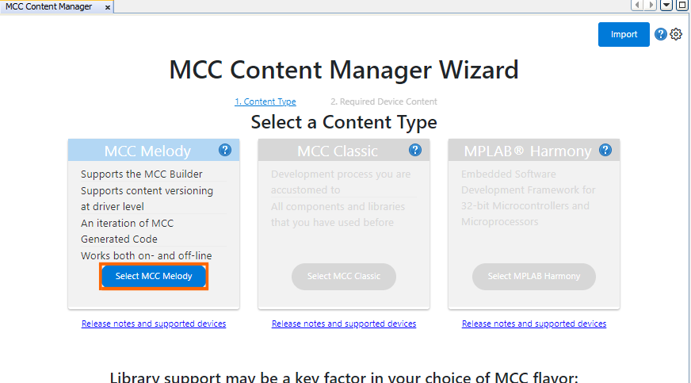
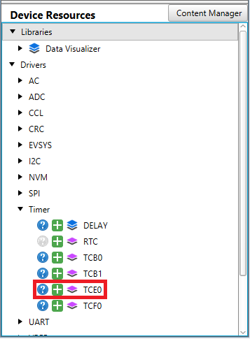

[](https://www.microchip.com)

## High Resolution Code Example

Below is an example of how to set a Timer Counter type E (TCE) instance to generate four Pulse-Width Modulation (PWM) signals. In this example the high resolution feature is highlighted. The user can increase the PWM signal resolution up to three bits.

## Related Documentation

More details and code examples on the AVR16EB32 can be found at the following links:

- [AVR<sup>®</sup> EB Product Page](https://www.microchip.com/en-us/product/AVR16EB32)
- [AVR<sup>®</sup> EB Code Examples on GitHub](https://github.com/microchip-pic-avr-examples?q=AVR16EB32)

## Software Used

- [MPLAB® X IDE v6.15 or newer](https://www.microchip.com/en-us/tools-resources/develop/mplab-x-ide)
- [AVR-Ex DFP-2.8.189 or newer Device Pack](https://packs.download.microchip.com/)
- [MPLAB® XC8 compiler v2.45](https://www.microchip.com/en-us/tools-resources/develop/mplab-xc-compilers/downloads-documentation#XC8)
- [MPLAB® Code Configurator (MCC) v5.3.7](https://www.microchip.com/en-us/tools-resources/configure/mplab-code-configurator)
- [MPLAB® Code Configurator (MCC) Melody Core v2.6.2 or newer](https://www.microchip.com/en-us/tools-resources/configure/mplab-code-configurator)

## Hardware Used

- [AVR<sup>®</sup> EB Curiosity Nano](https://www.microchip.com/en-us/product/AVR16EB32)

## Setup

The AVR16EB32 Curiosity Nano Development board is used as a test platform.

<br>

## Functionality

<br>After the peripheral clock, the output port pins and TCE are initialized, the  ```Scale_Mode_Change``` function is called in an infinite loop. This function is registered as a callback and is called in TCE Overflow Interrupt Service Routine (ISR). In this example TCE generates four PWM channels that have one peripheral clock cycle difference between each other.

<br>In the beginning the CMP0 register has the value of 10 (clock cycles), CMP1 has the value 11, CMP2 has the value 12, and CMP3 has the value 13. The values from CMPn registers increase until a maximum value is reached, then they restart from beginning and so on.

<br>The High Resolution feature can be set into 4X mode or 8X mode. In 4X mode, one pulse duration (one peripheral clock cycle) is shortened by 4 times. For example, if the peripheral clock frequency is 20MHz, then one clock cycle duration is 50 ns. If 4X resolution is applied, then one clock cycle duration becomes 12.5 ns. If 8X resolution is applied, then one clock cycle duration becomes 6.25 ns. The difference between CMP channels remains one clock cycle, only the pulse duration shortens and frequency increases. The duty cycles that have values below one clock cycle without high resolution enabled (50 ns), are set to '0' logic and are not visible on logic analyzer. They become visible after they reach the treshold of one clock cycle without high resolutioin eanbled (values > 50 ns).

<br>At runtime the resolution changes between three states: High Resolution OFF, 4X Resolution and 8X Resolution. Between each change there is a 2 seconds delay added in software. One GPIO pin is used to visualize on the logic analyzer when the resolution changes.

## Function Called in an Infinite Loop

```c
void Duty_Cycle_Update(void)
{
  /* Start with a duty cycle value of 10 peripheral clocks */
  static uint8_t dcy = 10;

  /* Increase duty cycle with one peripheral clock on each overflow interrupt */
  dcy++;

  /* Check if the duty cycle value has reached maximum */
  if(dcy > MAX_DCY)
    dcy = 10;

  /* update the values from CMP channels */
  TCE0_CompareAllChannelsBufferedSet(dcy, dcy + 1, dcy + 2, dcy + 3);
}
```

<br>

<br>To generate this project using MPLAB X IDE and the MPLAB X Code Configurator (MCC Melody, MCC Clasic is not supported on this device), follow the next steps:

<br>1. Open MPLAB X IDE and create a new project for AVR16EB32 device.

<br>2. Open MCC from the toolbar (more information on how to install the MCC plug-in can be found [here](https://onlinedocs.microchip.com/pr/GUID-1F7007B8-9A46-4D03-AEED-650357BA760D-en-US-6/index.html?GUID-D98198EA-93B9-45D2-9D96-C97DBCA55267)).

<br>3. In **MCC Content Manager** tab click the **Select MCC Melody** button and then click **Finish**.<br>
<br>
<br>

<br>4. Click on _Project Resources>System>Interrupt Manager_, then do the following configuration:
<br>
<br>

<br>5. Click on Project _Resources>System>CLKCTRL_, then do the following configuration:
<br>
    <br> - Disable the Prescaler enable button
    <br> - Clock Select: PLL Oscillator
    <br> - PLL Multiplication Factor: Multiply by 16
    <br> - PLL Source Division: DIV4 
    <br> - Prescaler B division PDIVB: DIV4
<br>

<br>6. To add the TCE module, go to _Device Resources>Drivers>Timer>TCE0_, then do the following configuration:
<br>
    <br> - Module Enable: Must be enabled by default, if not just toggle the button (it turns blue if enabled)
    <br> - Clock Selection: System clock (by default the divider must be 1 - System clock)
    <br> - Counter Direction: UP
    <br> - Waveform Generation Mode: Single-slope PWM mode with overflow on TOP
    <br> - Requested Period[s]: 0.001
    <br> - Duty Cycle 0 [%] : 0
    <br> - Duty Cycle 1 [%] : 0
    <br> - Duty Cycle 2 [%] : 0
    <br> - Duty Cycle 3 [%] : 0
    <br> - Waveform Output n : check the boxes from the Enable column for Waveform Output 0, 1, 2, 3
    <br> - Duty Cycle High Resolution: OFF (this is modified at run time)
    <br> - Generate ISR: toggle the button (it turns blue if enabled)
    <br> - Overflow Interrupt Enable: toggle the button (it turns blue if enabled)
<br>

<br>7. In the **Pin Grid View** tab check if the TCE WO [0-3] pins are locked as outputs on PORTA. When the boxes from Enable column from Output Settings of TCE are checked, the pins are also locked. To change the PORT simply click a pin from another PORT in **Pin Grid View**. Select from **Pin Grid View** PIN5 of PORTD as an output to toggle when the resolution is changed at run time.

 |            Pin           |    Configuration    |
 | :---------------------:  | :----------------:  |
 |            PA0           |   TCE WO0           |
 |            PA1           |   TCE WO1           |
 |            PA2           |   TCE WO2           |
 |            PA3           |   TCE WO3           |
 |            PD5           |   digital output    |

 <br>

<br>8. In the **Project Resources** tab, click the **Generate** button so that MCC will generate all the specified drivers and configurations.
<br>
<br>
<br>
<br>

<br>9. After the MCC Melody generates the project files with the configuration explained above, overwrite the content from the ```main.c``` file with this:

```c
/* Maximum value for duty cycle */
#define MAX_DCY (0x20)  


#include "mcc_generated_files/system/system.h"
#include <util/delay.h>

void Duty_Cycle_Update(void)
{
    /* Start with a duty cycle value of 10 peripheral clocks */
    static uint8_t dcy = 10;
    
    /* Increase duty cycle with one peripheral clock on each overflow interrupt */
    dcy++;
    
    /* Check if the duty cycle value has reached maximum */
    if(dcy > MAX_DCY)
        dcy = 10;
    
    /* update the values from CMP channels */
    TCE0_CompareAllChannelsBufferedSet(dcy, dcy + 1, dcy + 2, dcy + 3);
}

int main(void)
{
    SYSTEM_Initialize();
    TCE0_OverflowCallbackRegister(Duty_Cycle_Update);

    while(1)
    {
        TCE0_HighResSet(TCE_HREN_OFF_gc);
        IO_PD5_Toggle();
        _delay_ms(2000);
        TCE0_HighResSet(TCE_HREN_4X_gc);
        IO_PD5_Toggle();
        _delay_ms(2000);
        TCE0_HighResSet(TCE_HREN_8X_gc);
        IO_PD5_Toggle();
        _delay_ms(2000);
    }    
}
```

<br>10. Now the project can be built and run from MPLAB X IDE. At run time, the duty cycle values are updated at each overflow ISR of TCE, every 50us. The PWM resolution changes every 2 seconds.

## Operation

 1. Connect the board to the PC.

 2. Open the ```TCE_HighResolution.X``` solution in MPLAB X IDE.

 3. Right click the project and select Set as main project.

<br>

 4. Build the ```TCE_HighResolution.X``` project by clicking on **Clean and Build Project**.

<br>

 5. Click **Make and Program Device** to program the project to the board.

<br>

## Results

Below are illustrations of logic analyzer captures to help understand how the 4 PWM signals look, and how the high resolution feature works:

<br>High Resolution OFF 
<br>

<br>High Resolution 4X
<br>

<br>High Resolution 8X
<br>

## Summary

This project shows how to use the TCE to generate PWM signals in single ramp mode and how to use the high resolution feature of TCE.