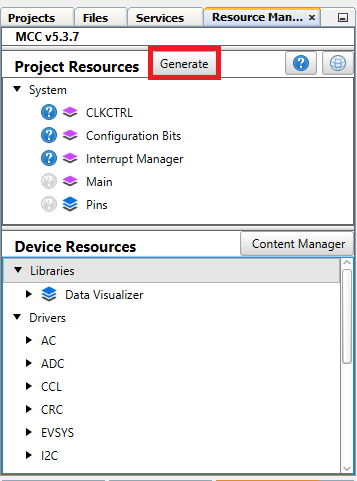

[](https://www.microchip.com)

## Dead time and Fault Code Example

Below is an example of how to set the Timer Counter type E (TCE) and Waveform Extension (WEX) peripherals to generate eight complementary Pulse-Width Modulation (PWM) signals at 20 kHz. In this example the fault filter feature of WEX is highlighted. When an event is detected and fault is triggered all the signals are driven low. This happens every 100ms. In order to do this the WEX must be configured for fault detection and the EVSYS must be configured to generate a fault triggering event. In this example the WEX module is used as a timer extension,
not in Pattern Generation mode. The fault can have a filter between zero and seven peripheral clock cycles. During this period the fault detection is ignored. If the fault condition is still active after the number of cycles set in the filter, then a fault is triggered. This ensures that a false fault trigger is not happenning.

## Related Documentation

More details and code examples on the AVR16EB32 can be found at the following links:

- [AVR<sup>®</sup> EB Product Page](https://www.microchip.com/en-us/product/AVR16EB32)
- [AVR<sup>®</sup> EB Code Examples on GitHub](https://github.com/microchip-pic-avr-examples?q=AVR16EB32)

## Software Used

- [MPLAB® X IDE v6.15 or newer](https://www.microchip.com/en-us/tools-resources/develop/mplab-x-ide)
- [AVR-Ex DFP-2.8.189 or newer Device Pack](https://packs.download.microchip.com/)
- [MPLAB® XC8 compiler v2.45](https://www.microchip.com/en-us/tools-resources/develop/mplab-xc-compilers/downloads-documentation#XC8)
- [MPLAB® Code Configurator (MCC) v5.3.7](https://www.microchip.com/en-us/tools-resources/configure/mplab-code-configurator)
- [MPLAB® Code Configurator (MCC) Melody Core v2.6.2 or newer](https://www.microchip.com/en-us/tools-resources/configure/mplab-code-configurator)

## Hardware Used

- [AVR<sup>®</sup> EB Curiosity Nano](https://www.microchip.com/en-us/product/AVR16EB32)

## Setup

The AVR16EB32 Curiosity Nano Development board is used as a test platform.

<br>

## Functionality

<br>After the peripheral clock, the output port pins, TCE, WEX and EVSYS are initialized, the  ```Create_Fault``` and ```Cear_Fault``` functions are called in an infinite loop. A fault is created using an event as the trigger source. After 100 ms the fault is cleared. Then, after another 100 ms another fault is triggered. This process repeats itself over and over again. All this time the TCE runs continuously, but when a fault is detected WEX takes control of the output pins. After a fault is cleared, the TCE can restart normal operation.

<br>This application configures TCE to run in Single Ramp mode at 20KHz. TCE generates 4 Pulse-Width Modulation (PWM) signals with: 20%, 40%, 60% and 80% values for duty cycles.
WEX is configured in Waveform Extension mode and generates complementary PWM signals for each PWM generated by TCE. WEX adds dead time in hardware so the signals are not overlapping. On each side of one complementary pair of PWM signals there is 150 ns dead time added.

<br>WEX fault handling mechanism is also configured in this project. WEX can receive an event on one of its three fault sources and drive all the output port pins in a desired state. In this example when a faut is detected all the pins are drive to `0` low logic. The fault event source in this code example is the PD5 GPIO pin, configured as an output. A fault is triggered when the pin goes to `1` high logic.

<br>WEX has fault hardware filter. When a fault is detected, WEX waits for a number of samples (ranging from zero to seven) to see if it was a false fault trigger or not. One sample has a duration of one peripheral clock cycle. Depending on the number of samples set at initialization, the fault will trigger immediately (zero samples) or after the number of samples duration. For a peripheral clock speed of 20 MHz, one clock cycle duration is 50 ns. The event propagation from EVSYS peripheral to WEX takes two clock cycles. For example, if the hardware fault filter is set to one sample, then a fault will be triggered 150 ns after detection (one sample is 50 ns and the event propagation duration is 100 ns).

## Functions Called in an Infinite Loop

```c
void Create_Fault(void)
{
  /* Fault creation, repeat in main loop to see it on LogicA. This is an event
    * generated using the logic level of PORTD Pin 5 */
  IO_PD5_SetHigh();
}

void Clear_Fault(void)
{
  /* Clear fault condition using a software command and disable the fault condition */
  IO_PD5_SetLow();
  WEX0_SoftwareCommand(WEX_CMD_FAULTCLR_gc); 
}
```

<br>

<br>To generate this project using MPLAB X IDE and the MPLAB X Code Configurator (MCC Melody, MCC Clasic is not supported on this device), follow the next steps:

<br>1. Open MPLAB X IDE and create a new project for the AVR16EB32 device.

<br>2. Open MCC from the toolbar (more information on how to install the MCC plug-in can be found [here](https://onlinedocs.microchip.com/pr/GUID-1F7007B8-9A46-4D03-AEED-650357BA760D-en-US-6/index.html?GUID-D98198EA-93B9-45D2-9D96-C97DBCA55267)).

<br>3. In **MCC Content Manager** tab click the **Select MCC Melody** button and then click **Finish**.<br>
<br>
<br>

<br>4. Click on _Project Resources>System>Interrupt Manager_, then do the following configuration:
<br>
    <br> - Toggle the Global Interrupt Enable button
<br>

<br>5. Click on Project _Resources>System>CLKCTRL_, then do the following configuration:
<br>
    <br> - Disable the Prescaler enable button
<br>

<br>6. To add the TCE module, go to _Device Resources>Drivers>Timer>TCE0_, then do the following configuration:
<br>
  <br> - Enable Timer: Should be enabled by default, if not just toggle the button (it turns blue if enabled)
  <br> - Clock Divider: System clock (by default the divider should be 1 - System clock)
  <br> - Waveform Generation Mode: Single-slope PWM mode
  <br> - Requested Period[s]: 0.00005
  <br> - Waveform Output n : check the boxes from the Enable column for Waveform Output 0, 1, 2, 3
  <br> - Duty Cycle 0 : 20%
  <br> - Duty Cycle 1 : 40%
  <br> - Duty Cycle 2 : 60%
  <br> - Duty Cycle 3 : 80%
<br>

<br>7. To add the WEX module, go to _Device Resources>Drivers>WEX>WEX0_, then do the following configuration:
<br>
  <br> - Input Matrix: Direct
  <br> - Update Source: TCE (the update condition for the output signals will be dictated by TCE)
  <br> - Override Settings: Check all the boxes from the Output Enable column for the Waveform Output [0-7]
  <br> - Dead-time Insertion Channel 0 Enable: toggle the button (it turns blue if enabled)
  <br> - Dead-time Insertion Channel 1 Enable: toggle the button (it turns blue if enabled)
  <br> - Dead-time Insertion Channel 2 Enable: toggle the button (it turns blue if enabled)
  <br> - Dead-time Insertion Channel 3 Enable: toggle the button (it turns blue if enabled)
  <br> - Requested Dead-time Low Side (μs) : 0.150
  <br> - Requested Dead-time High Side (μs) : 0.150
  <br> - Fault Event Input A : toggle the button (it turns blue if enabled)
  <br> - Fault Event A Filter : SAMPLE7
  <br> - Fault Event Input A Blanking Enable : Toggle the button (it turns blue if enabled) 
  <br> - Fault Enable: Toggle the button (it turns blue if enabled)
  <br> - Fault Interrupt Enable: Toggle the button (it turns blue if enabled)
  <br> - Fault Detection Restart Mode: Latched
  <br> - Fault Detection Action: Low
<br>
 
<br>8. To add the EVSYS module, go to _Device Resources>Drivers>EVSYS_, then do the following configuration:
<br>
  <br> - GENERATORS: PORTD_EV0
  <br> - CHANNELS: CHANNEL0
  <br> - USERS: WEXA (from CHANNEL0 rectangle from CHANNELS tab hold and drag the cursor to the WEXA rectangle from the USERS tab)
<br>

<br>9. In the **Pin Grid View** tab check if the WEX WO [0-7] pins are locked as outputs on PORTA. When the boxes from Output Enable column from Override Settings of WEX are checked, the pins are also locked. To change the PORT simply click a pin from another PORT in **Pin Grid View**. Set PD5 as output to toggle it at run time and generate faults.

 |Pin                       | Configuration       |
 | :---------------------:  | :----------------:  |
 |            PA0           |    WEX WO0          |
 |            PA1           |    WEX WO1          |
 |            PA2           |    WEX WO2          |
 |            PA3           |    WEX WO3          |
 |            PA4           |    WEX WO4          |
 |            PA5           |    WEX WO5          |
 |            PA6           |    WEX WO6          |
 |            PA7           |    WEX WO7          |
 |            PD5           |    digital output   |

 <br>


<br>10. In the **Project Resources** tab, click the **Generate** button so that MCC will generate all the specified drivers and configurations.
<br>
<br>
<br>
<br>

<br>11. After the MCC Melody generates the project files with the configuration explained above, overwrite the content from the ```main.c``` file with this:

```c
#include "mcc_generated_files/system/system.h"
#include <util/delay.h>

void Create_Fault(void)
{
    /* Fault creation, repeat in main loop to see it on LogicA. This is an event
     * generated using the logic level of PORTD Pin 5 */
    IO_PD5_SetHigh();
}

void Clear_Fault(void)
{
    /* Clear fault condition using a software command and disable the fault condition */
    IO_PD5_SetLow();
    WEX0_SoftwareCommand(WEX_CMD_FAULTCLR_gc); 
}

int main(void)
{
    SYSTEM_Initialize();
    

    while(1)
    {
        Create_Fault();
        _delay_ms(100);
        Clear_Fault();
        _delay_ms(100);
    }    
}
```

<br>12. Now the project can be built and run from MPLAB X IDE. At run time, a fault is produced with WEX to drive TCE's outputs to low `0` logic. After some software delays the fault is cleared, to ensure TCE's restart to normal operation.

## Operation

 1. Connect the board to the PC.

 2. Open the ```WEX_DT_FAULT.X``` solution in MPLAB X IDE.

 3. Right click the project and select Set as main project.

<br>

 4. Build the ```WEX_DT_FAULT.X``` project by clicking on **Clean and Build Project**.

<br>

 5. Click **Make and Program Device** to program the project to the board.

<br>

## Results

Below are illustrated two logic analyzer captures to understand how the WEX generates a complementary waveform signal for each PWM signal generated by TCE, and how the fault handling and fault filter work in hardware:

<br>Fault trigger after one sample filtering (after 150ns):
<br>

<br>Fault trigger after seven samples filtering (after 450ns):
<br>

## Summary

This project shows how to use the WEX and TCE to generate complementary PWM signals and how to use the fault features of WEX. Using TCE and WEX can generate up to eight PWM signals complementary in four independent pairs.