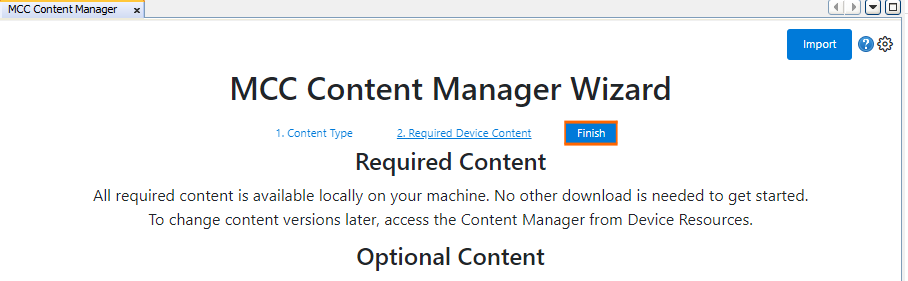
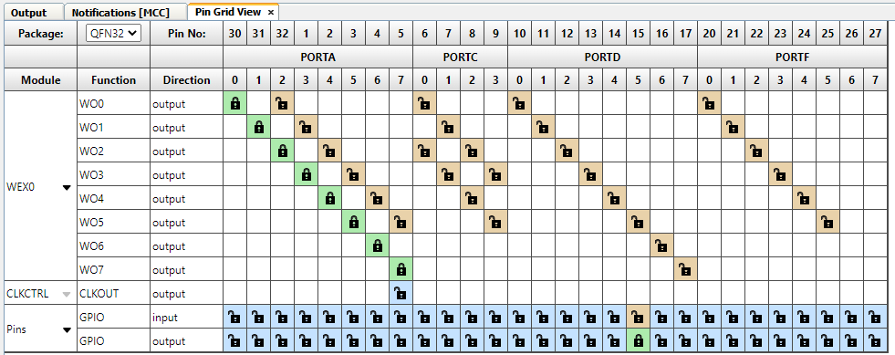

[](https://www.microchip.com)

## Pattern Generation and Swap Code Example

A basic use case of the Waveform Extension (WEX) peripheral is to set a pattern for the output signals that changes periodically. This example shows how WEX can take control of output signals from TCE and generate patterns, and how the Swap feature works.

## Related Documentation

More details and code examples on the AVR16EB32 can be found at the following links:

- [AVR<sup>®</sup> EB Product Page](https://www.microchip.com/en-us/product/AVR16EB32)
- [AVR<sup>®</sup> EB Code Examples on GitHub](https://github.com/microchip-pic-avr-examples?q=AVR16EB32)

## Software Used

- [MPLAB® X IDE v6.15 or newer](https://www.microchip.com/en-us/tools-resources/develop/mplab-x-ide)
- [AVR-Ex DFP-2.8.189 or newer Device Pack](https://packs.download.microchip.com/)
- [MPLAB® XC8 compiler v2.45](https://www.microchip.com/en-us/tools-resources/develop/mplab-xc-compilers/downloads-documentation#XC8)
- [MPLAB® Code Configurator (MCC) v5.3.7](https://www.microchip.com/en-us/tools-resources/configure/mplab-code-configurator)
- [MPLAB® Code Configurator (MCC) Melody Core v2.6.2 or newer](https://www.microchip.com/en-us/tools-resources/configure/mplab-code-configurator)

## Hardware Used

- [AVR<sup>®</sup> EB Curiosity Nano](https://www.microchip.com/en-us/product/AVR16EB32)

## Setup

The AVR16EB32 Curiosity Nano Development board is used as a test platform.

<br>

## Functionality

<br>After the peripheral clock, the output port pins, TCE and WEX are initialized, the  ```WEX0_PatternGenerationOverrideSet```, ```WEX0_PatternGenerationOutputSet``` and ```WEX0_SwapChannelSet``` functions are called in an infinite loop. These functions are MCC Melody generated APIs for the low level driver of WEX peripheral.

<br>This application configures TCE to run in single ramp mode at 20KHz. TCE generates 4 Pulse-Width Modulation (PWM) signals with: 15%, 25%, 60% and 75% values for duty cycles.
WEX is configured in Pattern Generation Mode and is able to take pin control and override the outputs of TCE, while TCE is running. WEX also generates complementary outputs for each PWM signal generated by TCE in hardware.

<br>The swap feature changes the value of duty cycle for the PWM signal generated by TCE with the value of duty cycle from the complementary PWM signal generated by WEX and vice-versa.

<br>At runtime WEX takes control of the output pins and generates a complementary pattern for 40 ms. Then WEX gives back control of output pins to TCE who is running and generates 4 PWM signals with 15%, 25%, 60% and 75% duty cycles. After another 100 ms WEX takes back control of the output pins and activates the Swap feature. For another 40 ms a complementary pattern is set, then WEX gives back control of the output pins to TCE. This time TCE is running and generates 4 PWM signals with 85%, 75%, 40% and 25% duty cycles. This happens because the Swap feature is active. After another 100 ms the process repeats itself over and over.

## Functions Called in an Infinite Loop

```c
void WEX0_PatternGenerationOverrideSet(uint8_t channels)
{
    WEX0.PGMOVR = channels;
}

void WEX0_PatternGenerationOutputSet(uint8_t channels)
{
    WEX0.PGMOUT = channels;
}

void WEX0_SwapChannelSet(uint8_t channels)
{
    uint8_t temp;
    temp = (WEX0.SWAP & ~(WEX_SWAP0_bm | WEX_SWAP1_bm | WEX_SWAP2_bm | WEX_SWAP3_bm)) |
           (channels  &  (WEX_SWAP0_bm | WEX_SWAP1_bm | WEX_SWAP2_bm | WEX_SWAP3_bm));
    WEX0.SWAP = temp;
}
```

<br>

<br>To generate this project using MPLAB X IDE and the MPLAB X Code Configurator (MCC Melody, MCC Clasic is not supported on this device), follow the next steps:

<br>1. Open MPLAB X IDE and create a new project for the AVR16EB32 device.

<br>2. Open MCC from the toolbar (more information on how to install the MCC plug-in can be found [here](https://onlinedocs.microchip.com/pr/GUID-1F7007B8-9A46-4D03-AEED-650357BA760D-en-US-6/index.html?GUID-D98198EA-93B9-45D2-9D96-C97DBCA55267)).

<br>3. In **MCC Content Manager** tab click the **Select MCC Melody** button and then click **Finish**.<br>
<br>
<br>

<br>4. Click on Project _Resources>System>CLKCTRL_, then do the following configuration:
<br>
    <br> - Disable the Prescaler enable button
<br>

<br>5. To add the TCE module, go to _Device Resources>Drivers>Timer>TCE0_, then do the following configuration:
<br>
    <br> - Module Enable - toggle the button (it turns blue if enabled)
    <br> - Clock Selection: System clock (by default the divider must be 1 - System clock)
    <br> - Waveform Generation Mode: Single-slope PWM mode with overflow on TOP
    <br> - Requested Period[s]: 0.00005
    <br> - Duty Cycle 0 [%] : 15
    <br> - Duty Cycle 1 [%] : 25
    <br> - Duty Cycle 2 [%] : 60
    <br> - Duty Cycle 3 [%] : 75
    <br>  - Waveform Output n : check the boxes from the Enable column for Waveform Output 0, 1, 2, 3
<br>

<br>6. To add the WEX module, go to _Device Resources>Drivers>WEX>WEX0_, then do the following configuration:
<br>
    <br> - Input Matrix: Direct
    <br> - Update Source: TCE (the update condition for the output signals will be the TCE module)
    <br> - Override Settings: Check all the boxes from the Output Enable column for the Waveform Output[0-7]
    <br> - Dead time Insertion Channel Enable for all 4 channels
    <br> - Pattern Generation Mode Enable: toggle the button (it turns blue if enabled)
    <br> - Pattern Generation Actions : check all the boxes from the Override Enable column and set for each output a desired state (LOW or HIGH), in order to set a pattern
<br>

<br>7. In the **Pin Grid View** tab check if the WEX WO [0-7] pins are locked as outputs on PORTA. When the boxes from Output Enable column from Override Settings are checked, the pins are also locked. To change the PORT simply click a pin from another PORT in **Pin Grid View**. Select PIN5 of PORTD as an output to use for toggle to see when WEX takes control of outputs from TCE.

 |Pin                       | Configuration       |
 | :---------------------:  | :----------------:  |
 |            PA0           |   WEX WO0           |
 |            PA1           |   WEX WO1           |
 |            PA2           |   WEX WO2           |
 |            PA3           |   WEX WO3           |
 |            PA4           |   WEX WO4           |
 |            PA5           |   WEX WO5           |
 |            PA6           |   WEX WO6           |
 |            PA7           |   WEX WO7           |
 |            PD5           |   digital output    |

 <br> 

<br>8. In the **Project Resources** tab, click the **Generate** button so that MCC will generate all the specified drivers and configurations.
<br>
<br>
<br>
<br>

<br>9. After the MCC Melody generates the project files with the configuration explained above, overwrite the content from the ```main.c``` file with this:

```c
/* Calculated values for PGMOUT and SWAP registers of WEX */
#define PATTERN                 (0xAA)
#define COMPLEMENTARY_PATTERN   (0x55)
#define PGM_OVERRIDE_DISABLE    (0x00)
#define PGM_OVERRIDE_ENABLE     (0xFF)
#define SWAP_CHANNELS_ENABLE    (0x0F)
#define SWAP_CHANNELS_DISABLE   (0x00)


#include "mcc_generated_files/system/system.h"
#include <util/delay.h>

int main(void)
{
    SYSTEM_Initialize();


    while(1)
    {
        /* Set which pins can be overridden in Pattern Generation Mode, take control of the output pins from TCE */
        WEX0_PatternGenerationOverrideSet(PGM_OVERRIDE_ENABLE);
        
        /* Disable channel swap feature */
        WEX0_SwapChannelSet(SWAP_CHANNELS_DISABLE);
        
        _delay_ms(10);
        
        /* Set a pattern for WEX's outputs */
        WEX0_PatternGenerationOutputSet(PATTERN);
        
        _delay_ms(10);
        
        /* Set a complementary pattern for WEX's outputs */
        WEX0_PatternGenerationOutputSet(COMPLEMENTARY_PATTERN);
        
        _delay_ms(10);
        
        /* Set a pattern for WEX's outputs */
        WEX0_PatternGenerationOutputSet(PATTERN);
        
        _delay_ms(10);
        
        /* Set a complementary pattern for WEX's outputs */
        WEX0_PatternGenerationOutputSet(COMPLEMENTARY_PATTERN);
        
        _delay_ms(10);
        
        /* Disable pin override with WEX in PAttern Generation Mode, give pin control back to TCE,
         * TCE is never stopped, it always runs in background */
        WEX0_PatternGenerationOverrideSet(PGM_OVERRIDE_DISABLE);
        
        /* GPIO Toggle to show when WEX gives or takes control of output port pins from TCE */
        IO_PD5_Toggle();
        
        _delay_ms(100);
        
        /* Set which pins can be overridden in Pattern Generation Mode, take control of the output pins from TCE */
        WEX0_PatternGenerationOverrideSet(PGM_OVERRIDE_ENABLE);
        
        /* Enable channel swap feature */
        WEX0_SwapChannelSet(SWAP_CHANNELS_ENABLE);
        
        _delay_ms(10);
        
        /* Set a pattern for WEX's outputs with swap feature active */
        WEX0_PatternGenerationOutputSet(PATTERN);
        
        _delay_ms(10);
        
        /* Set a complementary pattern for WEX's outputs with swap feature active */
        WEX0_PatternGenerationOutputSet(COMPLEMENTARY_PATTERN);
        
        _delay_ms(10);
        
        /* Set a pattern for WEX's outputs with swap feature active */
        WEX0_PatternGenerationOutputSet(PATTERN);
        
        _delay_ms(10);
        
        /* Set a complementary pattern for WEX's outputs with swap feature active */
        WEX0_PatternGenerationOutputSet(COMPLEMENTARY_PATTERN);
        
        _delay_ms(10);
        
        /* Disable pin override with WEX in PAttern Generation Mode, give pin control back to TCE,
         * TCE is never stopped, it always runs in background */
        WEX0_PatternGenerationOverrideSet(PGM_OVERRIDE_DISABLE);
        
        /* GPIO Toggle to show when WEX gives or takes control of output port pins from TCE */
        IO_PD5_Toggle();
        
        _delay_ms(100);
    }    
}
```

<br>10. Now the project can be built and run from MPLAB X IDE. At run time TCE generates 4 PWM signals and WEX generates complementary signals, activates the swap feature and can override the port output pins and change the state of each pin from '0' logic to '1' logic or vice-versa.


## Operation

 1. Connect the board to the PC.

 2. Open the ```WEX_Pgm_Swap.X``` solution in MPLAB X IDE.

 3. Right click the project and select Set as main project.

<br>

 4. Build the ```WEX_Pgm_Swap.X``` project by clicking on **Clean and Build Project**.

<br>

 5. Click **Make and Program Device** to program the project to the board.

<br>

## Results

Below are illustrated logic analyzer captures, to help understanding a little bit better how to override the port pins and take the pins control from TCE using the WEX module:


<br>Switching from an alternating '1', '0' logic pattern back to PWM outputs. 
<br>

<br>PWM outputs with Swap feature disabled.
<br>

<br>PWM outputs with Swap feature enabled.
<br>

## Summary

This project shows how to use the WEX to generate different patterns, and take control of the TCE pins during runtime, without stopping the timer. This is extremely useful for applications like for e.g. trapezoidal motor control, where some PWM signals must be forced to low '0' logic depending on the commutation sector.